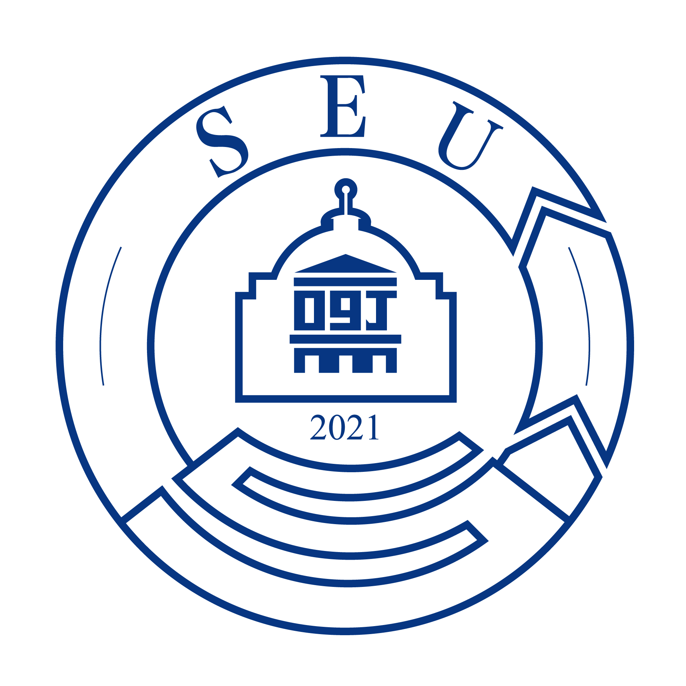

东南大学计算机科学拔尖学生培养基地，依托东南大学计算机科学与技术国家级一流本科专业建设点、“双一流”国家重点学科进行建设。基地于2021年11月入选教育部基础学科拔尖学生培养计划2.0基地名单，目标是建成在国内有重要影响力、在国际上有较高知名度的计算机拔尖人才培养基地，培养一批有潜力的未来科学家和计算机科技领军人才。基地采取导师制、书院制、完全学分制，以及小班化、个性化、国际化、卓越化、本研一体化的“三制五化”人才培养模式，每年从全校理工科新生中遴选20人左右的优秀学生组成计算机科学拔尖班，进行特色化重点培养，以充分激发学生的创新潜能，并发挥拔尖学生的示范和带动效应。

{: style="display:block; margin:auto; width:220px;" }

徽标中“SEU”字样为东南大学的英文缩写，而大礼堂为东南大学的标志性建筑。大礼堂的窗户化作“09J”字样，为基地的专业号；大礼堂下方有“2021”字样，代表着基地的建立时间。外围的装饰环形成一个光环，同从大礼堂下延伸出的道路构成“CS”字样，为“计算机科学”的英文缩写。徽标整体取同学们从东南大学计算机科学拔尖学生培养基地出发，走上计算机科学的探索之路，路上或有曲折，但前途一片光明之意。

### 人才培养目标

面向国家战略需求与社会发展需要，坚持立德树人、科学选才、精心育才、厚植土壤，培养具有坚定的理想信念、高尚的道德情操、广博的知识基础、深厚的人文素养、严谨的科学追求，德智体美劳全面发展，志愿投身计算机领域基础与前沿问题研究，具有较强的计算机系统能力和实践能力、突出的基础理论创新和关键技术突破能力，拥有家国情怀和国际视野，致力于解决计算机领域关键基础问题的未来战略科学家和科技领军人才。

### 学生能力素质要求

毕业生应具备坚定的理想信念、远大的发展志向、强烈的社会责任感，坚实的基础理论知识、优良的人文社科素养，具有突出的自主学习、独立思考和研究创新能力，优秀的交流表达能力、宽广的国际化视野和卓越的领导力素质。

### 培养模式

计算机科学拔尖基地的学生培养模式在如下方面具有特色：竞赛-科研双促进机制、书院制双院共建培养、严格学术导师负责制、特色活动与设施配套、系统化课程体系、国际交流与联合培养、创新能力与个性化培养、本研贯通培养。

#### （1）竞赛-科研双促进机制

建立竞赛-科研双促进机制。组织低年级学生参加ACM/ICPC等高水平学科竞赛，通过国际化竞赛提升学生计算机基础能力、沟通交流与团队协作能力，提升学生国际化视野。大二、大三学生结合导师科研课题进行科研探索，将理论知识转化为实际创新能力。开展竞赛交流、学术沙龙等学生交流活动，开展学术导师讲座交流活动，提升学生创新、科技视野，形成一批国际性的学科竞赛成果和高水平的科学研究成果。

#### （2）书院制双院共建培养

拔尖计划的专业课程与学科实践依托计算机学院开展，书院课程联合吴健雄学院共同开展，两院紧密协作、联合培养。注重对学生思想建设、学业发展、生活成长等的指导，积极推动不同专业背景的交叉、不同思维模式的碰撞、不同兴趣爱好的交融。不定期地举办人文社科讲座及艺术活动，营造浸润式、熏陶式的书院制人才培育环境。

#### （3）严格学术导师负责制

形成严格导师负责制，学生全程接受学术导师的学业指导，参加学术讨论、课题研究，以及“互联网+”等真实的课外科研实践。每个学生可以通过学生-导师双选机制选择合适自己的科研导师，导师负责指导拔尖生进行科研课题研究，指导撰写高水平论文，并负责指导毕业设计与毕业论文。

学生-导师双选机制，大一学年，每个学生可选若干位老师实验室进行LabExplore交流活动，了解感兴趣的相关方向实验室科研、学生培养情况。大二学年开始，每个学生根据意向和导师名额情况进行一对一双选成为科研导师，签署导师培养同意书，达到拔尖班学生培养要求。除了校内导师外，每个学生还有境外导师辅助培养。

#### （4）特色活动与设施配套

打造适合拔尖学生成长成才的环境与条件。除了共享吴健雄学院的课程资源之外，在学院层面开展书院制试点，升级改造教学实验条件和学习生活空间。开办线上书院、学子论坛、体育节等特色活动，营造多学科交叉、求索创新的优良氛围，产生有较大影响的特色品牌项目与活动，提升拔尖班学生的荣誉感、协作能力、综合发展能力。

#### （5）系统化课程体系

以提升学术素养和实践创新能力为核心，构建由核心课程、学术素养培养和领导力素质培养“三位一体”的培养体系。专业课程设置参考教育部计算机领域本科教育教学改革试点工作计划（“101计划”）核心课程。

①核心课程由健雄博雅计划、自然科学基础、专业基础课程、专业主干课程及自主发展课程等多个层次构成。

②学术素养与研究能力培养，包括以发现问题为导向的创新科研实践、以解决问题为目标的学科竞赛类活动，以及面对复杂科学与工程问题的综合运用类实践；覆盖从系列研讨课入门、SRTP项目平台，到与导师制关联的三阶段工程科研实践训练的全过程。

③领导力素质培养全面纳入书院综合课程，由社会实践、文化素质、国际交流学习等方面的培养考核共同组成。该环节与建雄博雅计划、学科理论与实践强化相结合，共同奠定学生多学科交叉融合、迎接未来问题挑战的能力基础，帮助学生构建大格局、大视野及远期发展能力。

#### （6）国际交流与联合培养

学术导师联合境外一流高校教师形成双导师培养制，鼓励学生参与境外学校联合培养，培养学生树立国际意识、拓宽国际视野，能够和世界一流大学的学生同台竞技。学生在读期间须至少参加国际交流一次，学校建立多层次国际交流平台，提供出国（境）交流学习3-6个月以上的机会，并提供政策和资金支持。拔尖计划学生优先选修英文版课程，打牢参与国际交流的专业和语言基础。

#### （7）创新能力与个性化培养

采取“理论导研、实践强研、课外拓研、网络助研”四位一体的研究型教学，激发学生的创新潜能。建立研究学分与课程学分的替换办法，鼓励学生进行科研探索，提高自主学习能力，以充分激发学生的个性潜质。学生可在弹性学制范围内，结合自身特点，在导师指导下制订个性化培养方案，修读包括本专业拓展课程和跨专业交叉课程在内的相关课程。

#### （8）本研贯通培养

构建本研一体化的课程体系与培养机制，提高基础课程挑战度，增加研讨课、科研课程学分，考核侧重科研能力。精心设计课程层次和授课内容，把本科阶段SRTP、学科竞赛等与研究生阶段的课题研究贯通设计，实施研究能力的贯通培养。学院为拔尖学生设立本研一体培养的奖励与激励机制，拔尖计划学生将拥有更多推免读研的机会。

### 动态进出机制

#### 选拔机制：

拔尖计划学生每届不超过20人，做到”优中选优”。建立科学化、多阶段的动态进出机制，通过新生入校后二次选拔选鉴拔尖学生；设立退出机制，按学年进行跟踪考核，并适时补充优质生源。学生来源有两个渠道：一是新生入学后面向全校选拔，进入计算机拔尖班学习；二是在大一结束、有空余名额时，面向计算机大类学生选拔，从报名学生中择优补选至计算机科学拔尖班学习。

#### 退出机制：

每学年对学生进行考核，对出现学习成绩明显下滑、课程（首修）不及格、考试作弊、学术不端等情况经专家组考核认定年度综合表现较差或不适合继续于拔尖班进行培养的学生，分别给予警告或不合格评价。对主动提出退出拔尖班培养和考核不合格的学生，将退出至计算机科学与技术专业普通班继续培养。

